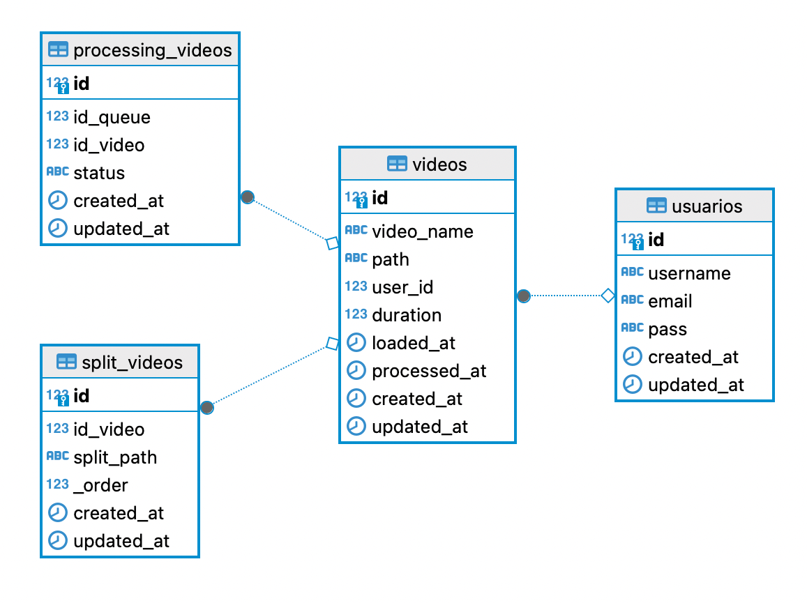

**Credenciales de la Base de Datos**

Las credenciales de la base de datos se encuentran en el archivo `.env`. Estas variables están diseñadas para ser reutilizadas rápidamente entre los distintos contenedores que las requieran.

**Diagrama de bases de datos actual**

**Uso:**

- Ejecutar este comando para cargar las variables desde el archivo `.env` y levantar el docker compose: `docker-compose --env-file .env up`
- `docker-compose rm` para eliminar los contenedores del docker compose.
- `docker-compose build --no-cache` para cuando se hagan cambios en los contenedores y se quieran cargar las nuevas modificaciones.

**Info de contenedores:**

- **postgres:** Contenedor para la base de datos de PostgreSQL.
- **postgres-queries:** Contenedor que ejecuta queries para las tablas de la base de datos.

